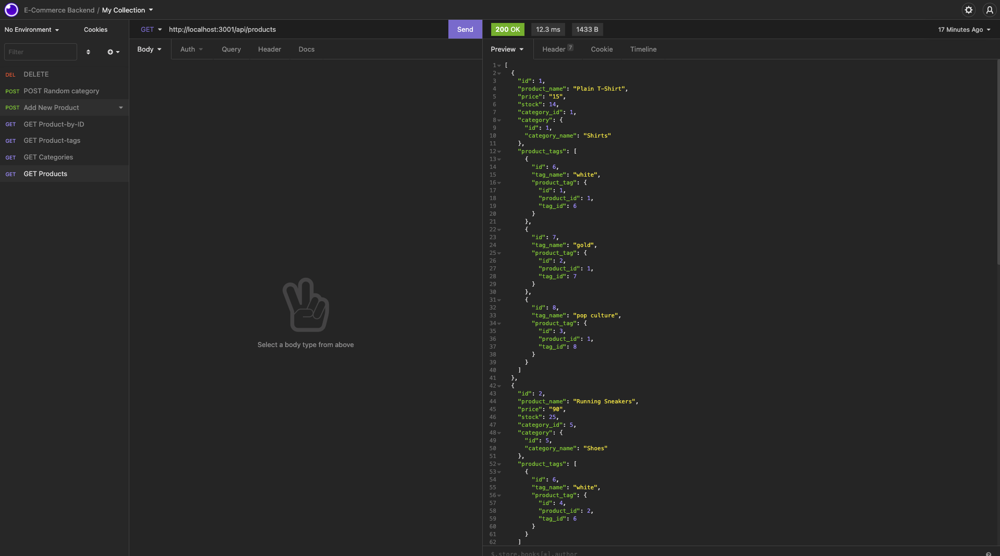

# E-Commerce
1. [Description](#Description)
2. [Installation](#Installation)
3. [Usage](#Usage)
4. [Deployment](#Deployment)
5. [Screenshots](#Screenshots)

## Description

An App to help e-commerce stores to manage their inventory and store front.

## Installation

To install the code, you can clone the repo. Use the terminal to initiate the program by using the command line and go to the local host port to access the api. Use an app like insomnia or postman to access the database to add, edit, or remove items.

## Usage

The app is backend app so the user needs to download or copy the repo. To use it successfully, the app must be connected to postman or insomnia to be used as an inventory database.

## Deployment

Video Link: [Google Drive Link to Video](https://drive.google.com/file/d/1OMU5t4WmbSSiU5NYjRLsFWmyhu9kICYP/view?usp=sharing)

Repo Link: [Github Repo](https://github.com/sytrejo/E-Commerce)

## Screenshots

